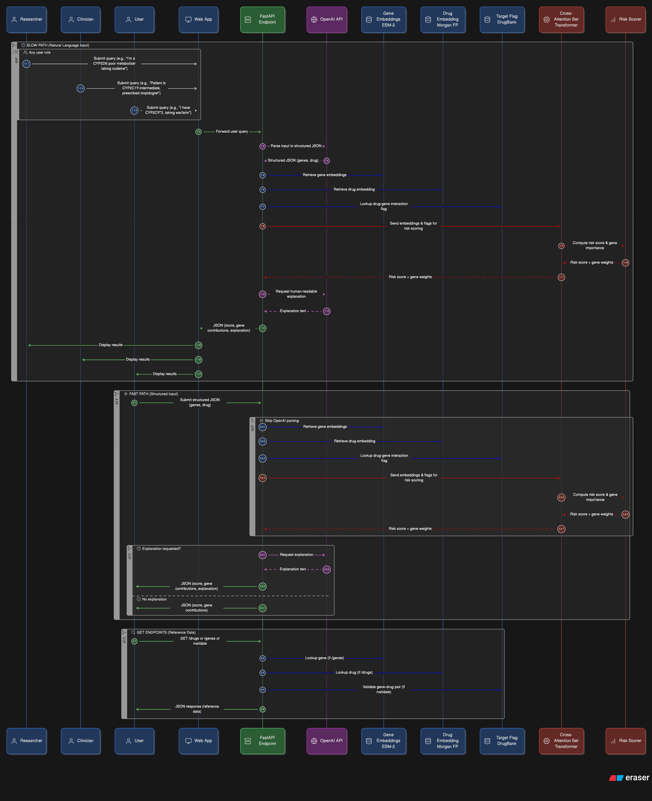

<p align="center">
  
</p>

<h1 align="center">PharmaRisk</h1>

<p align="center">
  <strong>Pharmacogenomics Drug Risk API</strong><br>
  Gene profile + drug &rarr; personalized risk score + clinical recommendation
</p>

<p align="center">
  
  
  
  
</p>

---

## Problem

**1.3 million emergency room admissions per year** in the U.S. are caused by adverse drug reactions. Most drugs are still prescribed based on symptoms and diagnosis alone — not genetics. Patients with certain gene variants metabolize drugs too quickly, too slowly, or not at all, leading to toxicity or treatment failure.

Pharmacogenomic guidelines exist (CPIC), but they're buried in academic tables that clinicians don't have time to look up mid-appointment.

## Solution

PharmaRisk is an API that takes a patient's **gene profile** and a **drug name**, and returns:

- A **risk score (1-10)** predicting how dangerous that gene-drug combination is
- The **CPIC clinical recommendation** text (e.g., "Avoid codeine use" or "Use standard dosing")
- A **plain-English explanation** suitable for patients
- **Gene-level contributions** showing which genes drive the risk

It supports both structured input (`{"genes": [...], "drug": "codeine"}`) and natural language input (`"I'm a CYP2D6 poor metabolizer taking codeine"`).

## Architecture

The system has two prediction paths:

1. **Natural Language Path** — User query &rarr; OpenAI parses to structured JSON &rarr; model pipeline
2. **Structured Path** — Direct JSON with gene/phenotype/drug &rarr; model pipeline

The model pipeline:
- **Gene embeddings** via ESM-2 protein language model
- **Drug embeddings** via Morgan fingerprints from SMILES
- **Target flags** from DrugBank drug-gene interactions
- **Cross-Attention Set Transformer** fuses multi-gene + drug features
- **Risk scorer** outputs score (1-10) + per-gene contributions

Post-prediction, OpenAI generates a patient-friendly explanation.

## Tech Stack

| Component | Technology |
|-----------|-----------|
| API | FastAPI + Uvicorn |
| Model | PyTorch (Set Transformer) + XGBoost baseline |
| Gene Embeddings | ESM-2 (Meta protein language model) |
| Drug Embeddings | RDKit Morgan fingerprints from SMILES |
| NLP | OpenAI gpt-4o-mini |
| Data | CPIC database, DrugBank, PubChem |
| Deployment | Railway / Docker / Modal |

## API Endpoints

| Method | Path | Description |
|--------|------|-------------|
| `GET` | `/health` | Health check — model/data status |
| `GET` | `/validate` | Validate loaded data, list available genes |
| `GET` | `/drugs` | List all drugs (paginated, searchable) |
| `GET` | `/drugs/{drug_id}` | Get drug details + SMILES |
| `GET` | `/genes` | List all genes (paginated, searchable) |
| `GET` | `/genes/{symbol}` | Gene details + alleles |
| `GET` | `/genes/{symbol}/alleles` | All alleles for a gene |
| `POST` | `/predict` | Predict risk from structured gene/drug input |
| `POST` | `/predict/natural` | Predict risk from natural language |
| `POST` | `/explain` | Generate plain-English explanation |

All list endpoints support `?search=`, `?page=`, `?limit=` parameters and return fuzzy "did you mean" suggestions on no results.

## Quickstart

```bash
# Clone
git clone https://github.com/Topupchips/HackIllinoisWinningIdea.git
cd HackIllinoisWinningIdea

# Install dependencies
pip install -r requirements.txt

# (Optional) Set OpenAI key for natural language features
export OPENAI_API_KEY=sk-...

# Run
uvicorn api.main:app --reload --port 8000

# Open interactive docs
open http://localhost:8000/docs
```

## Curl Examples

**Health check:**
```bash
curl http://localhost:8000/health
```
```json
{
  "status": "healthy",
  "model_loaded": false,
  "data_loaded": true,
  "drug_count": 323,
  "gene_count": 17
}
```

**Search drugs:**
```bash
curl "http://localhost:8000/drugs?search=codein"
```
```json
{
  "drugs": [{"drug_id": "RxNorm:2670", "drug_name": "codeine", "smiles": "CN1CCC23..."}],
  "total": 1, "page": 1, "limit": 20
}
```

**Predict risk (structured):**
```bash
curl -X POST http://localhost:8000/predict \
  -H "Content-Type: application/json" \
  -d '{
    "genes": [{"name": "CYP2D6", "phenotype": "Poor Metabolizer"}],
    "drug": "codeine"
  }'
```
```json
{
  "drug": "codeine",
  "risk_score": 7.5,
  "risk_label": "Moderate Risk",
  "gene_contributions": [{"gene": "CYP2D6", "phenotype": "Poor Metabolizer", "contribution": 0.8}],
  "recommendation_text": "CYP2D6: Greatly reduced morphine formation leading to diminished analgesia. | Avoid codeine use...",
  "cpic_recommendation": "Avoid codeine use because of possibility of diminished analgesia."
}
```

**Predict risk (natural language):**
```bash
curl -X POST http://localhost:8000/predict/natural \
  -H "Content-Type: application/json" \
  -d '{"query": "I am a CYP2D6 poor metabolizer taking codeine"}'
```

**Explain risk:**
```bash
curl -X POST http://localhost:8000/explain \
  -H "Content-Type: application/json" \
  -d '{"drug": "codeine", "risk_score": 8.5, "gene_contributions": {"CYP2D6": 0.85}}'
```
```json
{
  "explanation": "Your genetic profile suggests a higher risk with codeine. Your CYP2D6 gene variant may cause your body to process this drug differently, potentially leading to adverse effects. Please discuss alternative options with your doctor."
}
```

**Get gene details:**
```bash
curl http://localhost:8000/genes/CYP2D6
```

**Get drug by name:**
```bash
curl http://localhost:8000/drugs/codeine
```

## Validation Results

<!-- TODO: Fill in real numbers after model validation -->

| Metric | Value |
|--------|-------|
| Test set size | TBD |
| Mean Absolute Error | TBD |
| Spearman correlation | TBD |
| High-risk recall (score >= 7) | TBD |
| Low-risk precision (score <= 3) | TBD |

## Data Sources

| Source | License | Description |
|--------|---------|-------------|
| [CPIC](https://cpicpgx.org/) | CC0 (public domain) | Clinical pharmacogenomics guidelines (Stanford/NIH) |
| [PharmGKB](https://www.pharmgkb.org/) | CC BY-SA 4.0 | Pharmacogenomics knowledge base |
| [PubChem](https://pubchem.ncbi.nlm.nih.gov/) | Public domain | Drug SMILES / molecular structures |
| [DrugBank](https://go.drugbank.com/) | CC BY-NC 4.0 | Drug-gene target interactions |
| [ESM-2](https://github.com/facebookresearch/esm) | MIT | Protein language model for gene embeddings |

## AI Disclosure

*Required by HackIllinois rules.*

| Tool | Usage |
|------|-------|
| **OpenAI gpt-4o-mini** | Runtime: parses natural language input, generates patient-facing explanations |
| **ESM-2 (Meta)** | Gene sequence embeddings used as model features |
| **Claude Code (Anthropic)** | Development: code scaffolding, data pipeline scripts, API boilerplate |

**What we built ourselves:**
- Data extraction and cleaning pipeline (CPIC SQL, DrugBank XML, PubChem API)
- Risk score engineering and labeling logic
- Model architecture design (Cross-Attention Set Transformer + XGBoost)
- Training pipeline and feature engineering
- API design, endpoint logic, and service layer
- Validation framework

## Team

- **Sanjavan Ghodasara** — API, data pipeline, deployment
- **Charles** — Model architecture, training, embeddings

## License

MIT

---

<p align="center">
  Built for <a href="https://hackillinois.org">HackIllinois 2026</a>
</p>
